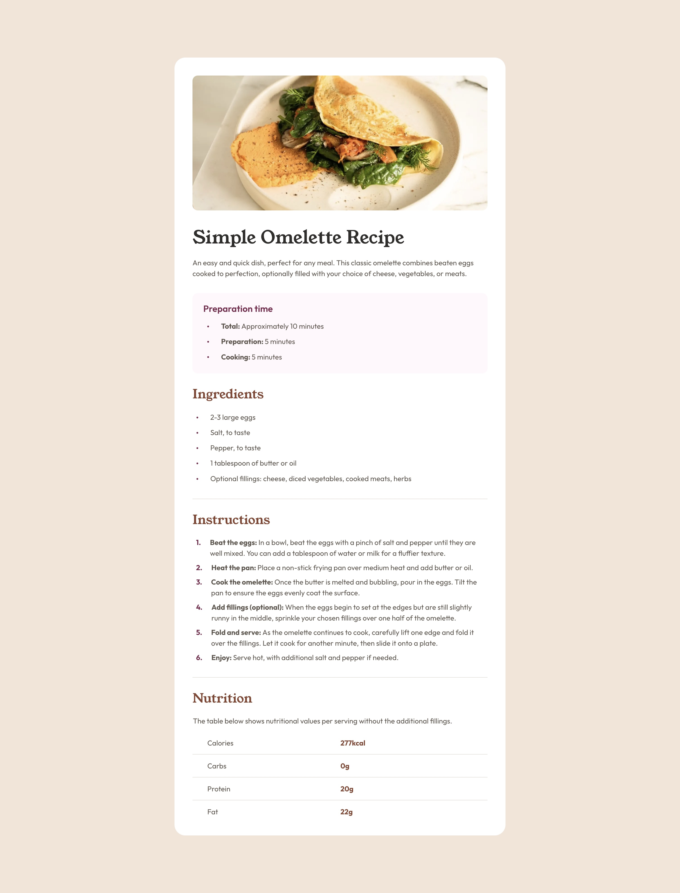

# Frontend Mentor - Recipe page solution

This is a solution to the [Recipe page challenge on Frontend Mentor](https://www.frontendmentor.io/challenges/recipe-page-KiTsR8QQKm). Frontend Mentor challenges help you improve your coding skills by building realistic projects. 

## Table of contents

- [Overview](#overview)
  - [The challenge](#the-challenge)
  - [Screenshot](#screenshot)
  - [Links](#links)
- [My process](#my-process)
  - [Built with](#built-with)
  - [Continued development](#continued-development)
- [Author](#author)

## Overview

### The Challenge

Your challenge is to build out this recipe page and get it looking as close to the design as possible.

### Screenshot

### Links

- Solution URL: [github.com/tloyan/frontendmentor-recipe-page](https://github.com/tloyan/frontendmentor-recipe-page)
- Live Site URL: [recipe-page.tloyan.com](https://recipe-page.tloyan.com)

## My process

### Built with

- [React](https://react.dev/)
- [Next.js](https://nextjs.org/)
- [TypeScript](https://www.typescriptlang.org/)
- [Tailwind CSS](https://tailwindcss.com/)

### Continued development

I’d like to focus more on using semantic tags to improve accessibility, continuously enhance my skills in responsive design, and create smooth animations.

## Author

- Website - [Thomas Loyan](https://www.thomasloyan.com)
- Frontend Mentor - [@tloyan](https://www.frontendmentor.io/profile/tloyan)